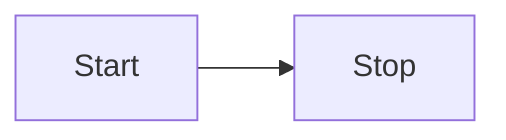

There are a lot of diagraming languages (see [text-to-diagram](https://stereobooster.com/posts/text-to-diagram/)). [Mermaid](https://mermaid.js.org/) seems to be popular (it is supported by GitHub).

## Ideal solution

- it would be rendered as SVG on the server side
  - so no JS required on the client-side
  - people can use <kbd>Cmd</kbd> + <kbd>F</kbd> to search text
- style it with CSS-variables (or CSS-classes)
  - so it would be possible to implement dark mode without JS
- optionally add small JS to implement pan/zoom/drag

## Options

There is no ideal solution so far. But here is what we can do instead:

- Client-side rendering with Mermaid
- Server-side rendering with Mermaid via headless browser
- Server-side rendering with [Pintora](https://pintorajs.vercel.app/)

See: [astro-diagrams](https://stereobooster.com/posts/astro-diagrams/)

## Server-side rendering via headless browser

- Mermaid doesn't support server-side rendering: [mermaid#3650](https://github.com/mermaid-js/mermaid/issues/3650)
- Prerendering with healdess browser: [mermaid-isomorphic](https://github.com/remcohaszing/mermaid-isomorphic)
- Related discussion in Starlight repo: [starlight#1259](https://github.com/withastro/starlight/discussions/1259)
- Component for diagram rendering: [astro-diagram](https://www.npmjs.com/package/astro-diagram) (I haven't tried it though)

### remark plugin

```bash title="Instal dependencies…"
pnpm add remark-mermaidjs
```

```js
// astro.config.mjs
import remarkMermaidjs from "remark-mermaidjs";

export default defineConfig({
  integrations: [
    starlight({
      customCss: ["./src/styles/custom.css"],
    }),
  ],
  markdown: {
    remarkPlugins: [remarkMermaidjs],
  },
});
```

[Author advices against using remark plugin and insists on using rehype plugin](https://github.com/remcohaszing/remark-mermaidjs/issues/23#issuecomment-1881313556).

You may need to fix some CSS for your diagrams, for example:

```css
// src/styles/custom.css
svg .node .label {
  line-height: 1.2;
}

.flowchart-link {
  stroke: var(--sl-color-white) !important;
}

.marker {
  stroke: var(--sl-color-white) !important;
  fill: var(--sl-color-white) !important;
}
```

### rehype plugin

`rehype-mermaidjs` doesn't work with Astro out of the box. Because of [remark-shiki](https://github.com/withastro/astro/blob/main/packages/markdown/remark/src/remark-shiki.ts). There are several workarounds:

- ~~use `rehype-raw`~~ (it used to work)
- ~~disable `remark-shiki` at all ([`markdown.syntaxHighlight: false`](https://docs.astro.build/en/reference/configuration-reference/#markdownsyntaxhighlight)) and use [`rehype-shikiji`](https://shikiji.netlify.app/packages/rehype)~~

There is upcoming feature to support dark mode: [rehype-mermaid#6](https://github.com/remcohaszing/rehype-mermaid/issues/6).

## Example

````md
// example.md


````


## Further improvements

- Add JS script to do pan/zoom/drag, for example, [svg-pan-zoom](https://github.com/bumbu/svg-pan-zoom)
