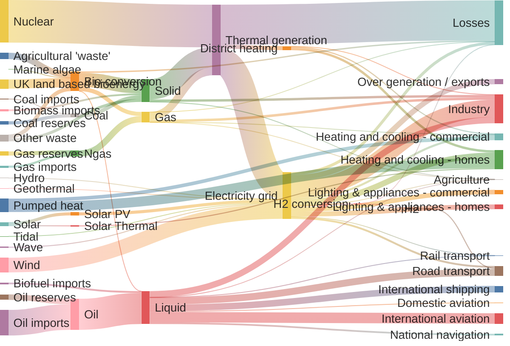
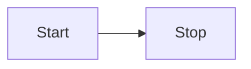

Example taken from [mermaid.js.org](https://mermaid.js.org/syntax/sankey.html)

There are a lot of diagraming languages (see [text-to-diagram](https://stereobooster.com/posts/text-to-diagram/)). [Mermaid](https://mermaid.js.org/) seems to be popular (it is supported by GitHub).

## @beoe/rehype-mermaid

### Installation

import { Steps } from "@astrojs/starlight/components";

<Steps>
1. Install dependencies

    ```bash
    pnpm add @beoe/rehype-mermaid
    ```

2. Configure Astro. See note about [[rehype-plugins-for-code]].

   ```js
   // astro.config.mjs
   import { rehypeMermaid } from "@beoe/rehype-mermaid";

   export default defineConfig({
     integrations: [
       starlight({
         customCss: ["./src/styles/custom.css"],
       }),
     ],
     markdown: {
       rehypePlugins: [
         [rehypeMermaid, { cache, strategy: "img-class-dark-mode" }],
       ],
     },
   });
   ```

3. Add CSS for dark mode:

   ```css
   // src/styles/custom.css
   html[data-theme="light"] .beoe-dark {
     display: none;
   }

   html[data-theme="dark"] .beoe-light {
     display: none;
   }
   ```

4. **Optional** install dependency for cache

   ```bash
   pnpm add @beoe/cache
   ```

5. **Optional** configure cache

   ```js
   // astro.config.mjs
   import { rehypeMermaid } from "@beoe/rehype-mermaid";
   import { getCache } from "@beoe/cache";

   const cache = await getCache();

   export default defineConfig({
     markdown: {
       rehypePlugins: [
         [rehypeMermaid, { cache, strategy: "img-class-dark-mode" }],
       ],
     },
   });
   ```

</Steps>

## rehype-mermaid

### Installation

<Steps>
1. Install dependencies

    ```bash
    pnpm add rehype-mermaid
    ```

2. Configure Astro. See note about [[rehype-plugins-for-code]].

   ```js
   // astro.config.mjs
   import { rehypeMermaid } from "rehype-mermaid";

   export default defineConfig({
     markdown: {
       rehypePlugins: [rehypeMermaid],
     },
   });
   ```

</Steps>

### Strategies

|                                                                                                    | `inline-svg` | `img-svg` |
| -------------------------------------------------------------------------------------------------- | ------------ | --------- |
| supports [`css`](https://github.com/remcohaszing/rehype-mermaid?tab=readme-ov-file#css) option     | ✔️ yes       | no        |
| text is searchable (<kbd>Cmd</kbd> + <kbd>F</kbd>)                                                 | ✔️ yes       | no        |
| supports [`dark`](https://github.com/remcohaszing/rehype-mermaid?tab=readme-ov-file#dark) mode (1) | no           | ✔️ yes    |
| issues with [`rehype-raw`](https://github.com/remcohaszing/rehype-mermaid/issues/17) (2)           | yes          | ✔️ no     |
| other CSS on the page may conflict (3)                                                             | yes          | ✔️ no     |

`inline-svg` is deafault strategy.

### (1) dark mode

In order to enable dark mode use:

```js
export default defineConfig({
  markdown: {
    rehypePlugins: [[rehypeMermaid, { strategy: "img-svg", dark: true }]],
  },
});
```

**But** it doesn't work with Starlight's slector based dark mode. See [starlight#1829](https://github.com/withastro/starlight/discussions/1829).

### (2) issues with rehype-raw

I noticed issues only with `sankey` diagram. So this is minor issue

### (3) other CSS

You may style inline SVG with CSS:

```css
// src/styles/custom.css
svg[id^="mermaid"] {
  /* undo global styles */
  .node .label {
    line-height: 1.2;
  }

  /* primitive dark mode */
  .flowchart-link {
    stroke: var(--sl-color-white) !important;
  }

  .marker {
    stroke: var(--sl-color-white);
    fill: var(--sl-color-white) !important;
  }

  .node-labels {
    fill: var(--sl-color-white);
  }
}
```

## Example

````md
// example.md


````


